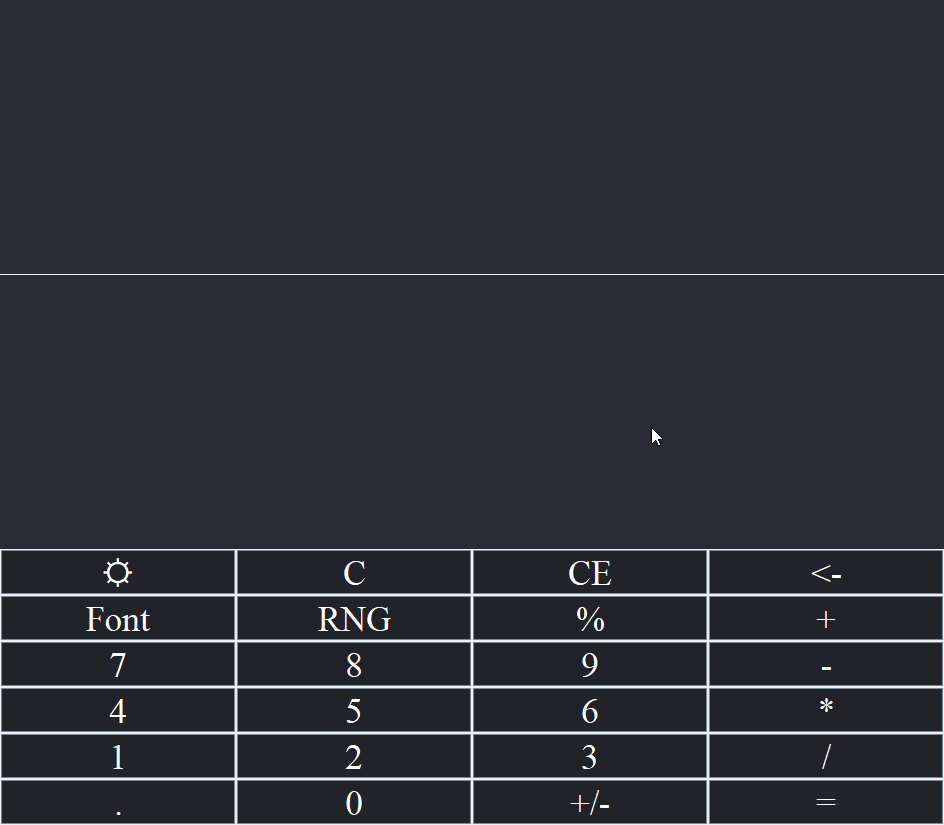

# Java Swing GUI Calculator
### Description:
Calculator built on the Swing GUI toolkit for Java, 
I used this project as an opportunity to get more familiar with Git and GitHub projects
and to work more in depth with GUIs, specifically with Swing in Java.

<br>

#### How to compile:
1- Make sure you have maven installed and Java 17

2- Run the following in your terminal while being in the project root
```shell
mvn package
```

3- Execute the jar by running the following from the project root
```shell
java -jar target/CustomCalculator-1.0-SNAPSHOT-shaded.jar 
```

<br>
<br>

#### Preview:

[]()